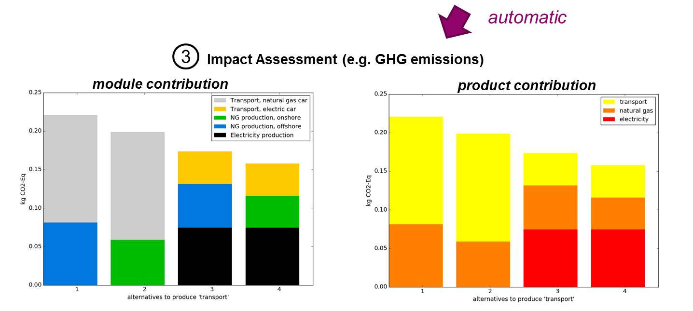

# A framework for Modular LCA. #

## What is it? ##

> The analogy of Modular LCA are puzzle pieces, which can be combined in different ways to reflect alternative scenarios
of the life cycle of products, or parts of supply or value chains.

Unit processes constitute the basis for modeling in Life Cycle Assessment (LCA). LCA product systems often consist of
thousands of unit processes that together describe the life cycle of a product. Modular LCA introduces an additional layer in between
unit processes and complete product systems. Unit processes can be associated with so-called "modules" describing parts of a life cycle,
similar to life cycle stages.

The Modular LCA framework can be applied to: 
- associate unit processes and impact assessment results with life cycle stages 
- streamline LCA based scenario comparisons (e.g. alternative manufacture, transportation, use phase or disposal processes)
- identify and optimize key choices in value chains 
- link LCA with other models (e.g. linear programming, material flow analysis)

The Modular LCA approach and some applications are described in this paper:
https://link.springer.com/article/10.1007/s11367-015-1015-3

### Example ###

The following shows an example of how modules (1) can be defined from existing unit processes. The modular system (2) is automatically generated based on user defined names for the input and output products of the modules. 

The result is a compact, life cycle stage representation of an underlying system of many unit processes. More importantly, it contains alternatives - which are enabled by the definition of substitutable products (e.g. natural gas, which can be supplied from distinct suppliers). An important advantage of the modular approach is that such alternatives can be modelled without the need to duplicate unit processes (e.g. Electricity production, from natural gas from Region 1 and Electricity production, from natural gas from Region 2).
Once a modular system has been defined, comparative impact assessment of all scenarios can be fully automated (see here by life cycle stage (i.e. by modules) or product).

A typical workflow: 
1. **defining the modules** takes most of the time 
2. **modular systems** are created automatically from a set of modules 
3. **scenario comparisons** can be created automatically from a modular system 

## License ##

Copyright (c) 2015 Bernhard Steubing.

## Installation ##

## Example Notebook ##

## Use within the Activity Browser ##

    old version
    new version