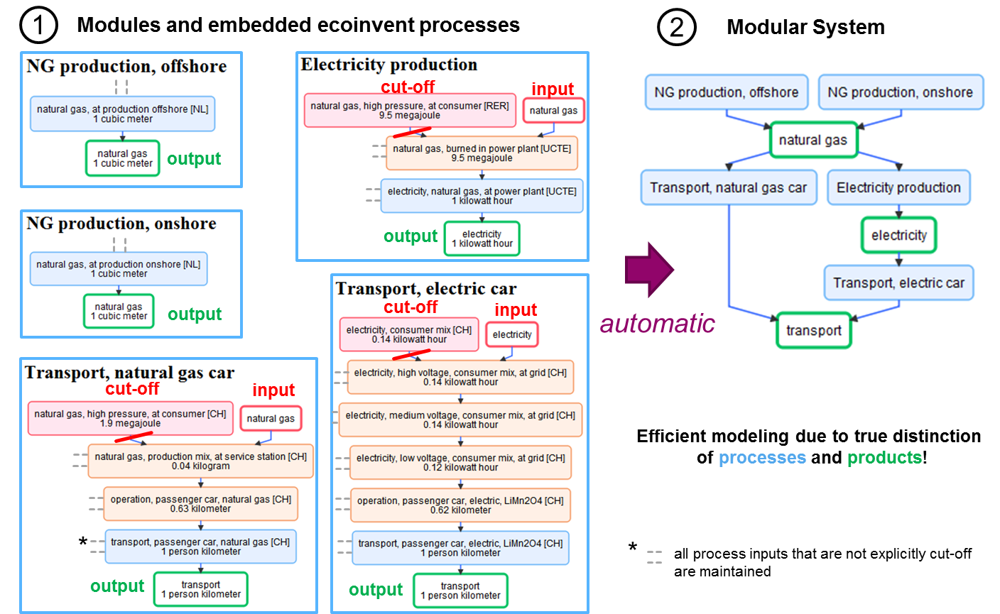

# A framework for Modular LCA. #

Licensed under the GNU General Public License. Copyright (c) 2015 Bernhard Steubing.

## General information ##

Unit processes constitute the basis for modeling in Life Cycle Assessment (LCA). LCA product systems often consist of
thousands of unit processes that together describe the life cycle of a product. Modular LCA introduces an additional layer in between
unit processes and complete product systems. Unit processes can be associated with so-called "modules" describing parts of a life cycle,
similar to life cycle stages.

There are several use cases where "modules" can come in handy:
- very simply for doing impact assessment of life cycle stages
- for modeling alternative scenarios for certain life cycle stages (e.g. manufacture, transportation, product use, and disposal)
- for developing an LCA-based optimization model (e.g. linear programming)

The implementation and advantages of the Modular LCA approach are described in detail in this paper:
https://link.springer.com/article/10.1007/s11367-015-1015-3

### Example ###

The following shows an example of how modules (left side) can be defined from existing unit processes. 
The modular system (right) is automatically generated based on user defined names for the input and output products of the modules.  
The result is a compact, life cycle stage representation of an underlying system of many unit processes. 
More importantly, it contains alternatives - which are enabled by the definition of substitutable products (e.g. natural gas, which can be supplied from distinct suppliers).
An important advantage of the modular approach is that such alternatives can be modelled without the need to duplicate unit processes 
(e.g. Electricity production, from natural gas from Region 1 and Electricity production, from natural gas from Region 2). 

The number of alternatives can quickly rise as shown in the following example. Once a modular system has been defined, 
a comparative impact asssessment of all alternatives is fully automated (see here by life cycle stage (i.e. by modules) or product).

> The analogy of Modular LCA are puzzle pieces, which can be combined in different ways to reflect alternative scenarios
of the life cycle of products, or parts of supply or value chains.

Often a situation arises where there are several alternatives for successive processing steps. In such cases, many
alternatives can arise quickly. Imagine a wood home heating, where you can choose from 3 different suppliers and two
different wood sources each as well as four different stoves. There will be 3x2x4=24 different possible scenarios.

One of the more powerful aspects of this Modular LCA framework is that modules

## Installation ##

## Example Notebook ##

## Use within the Activity Browser ##

    old version
    new version